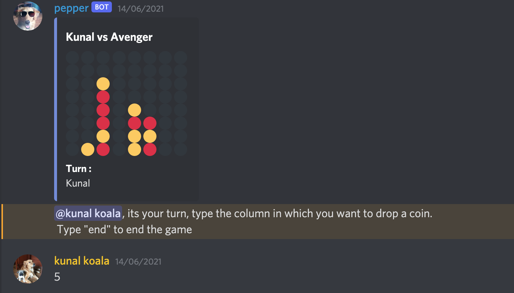
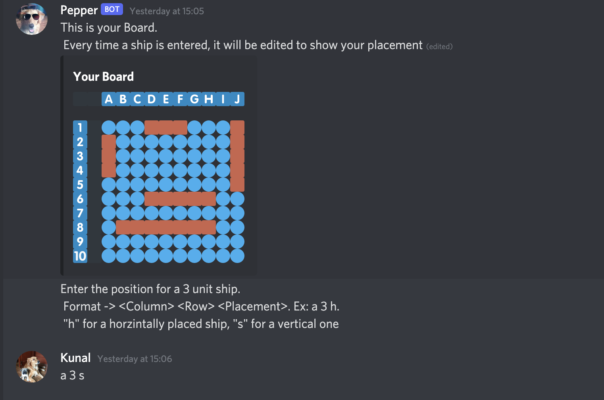

# Game Commands
Pepper comes with 4 built in game commands.

 * BattleShip
 * Connect4
 * TicTacToe
 * Rock Paper and Scissors

For simplicity, the game structure has been divided into the following hierarchy
```
Game
|                      
|                      
 --- SimpleBoardGame 
|    |
|     -- TicTacToe  
|     -- Connect4  
|
 --- ComplexBoardGame 
      |
       -- BattleShip
```
The primary difference between a simple and complex game is wether or not the player holds any game related data.
Taking Connect4 and Battleship for example

* Connect4 contains 1 board which does not belong to any player specifically. Further more each player does not store any data, all data is stored by the board itself. Thus: Each player can be simply represented as a **DiscordUser** which is why its a simple game

* Battleship contains 2 players who each have their own board. Furthermore each player has 5 ships. Thus the player themselves store game related data. For this reason the player is represented by **BattleShipPlayer** which inherits **DiscordPlayer**.

Connect4

 

BattleShip


