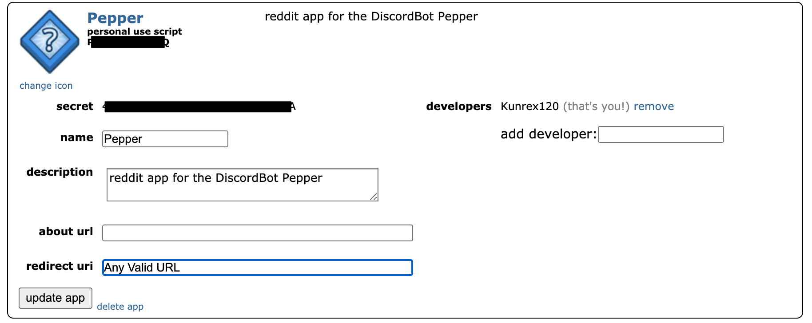
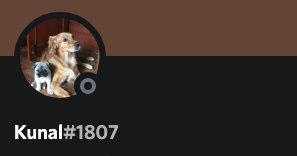

# Pepper.bot

Pepper is a discord bot I made a while back to learn. Its written in C#. It's not a public bot ~~yet~~, but has shards implemented.
Its got everything I wanted it to have when I started to work on it so I've haulted progress on it. I may come back to add a few things here and there.


## Table Of Contents
* General Info
* Technologies
* Setting Up
* Plans for the future

## General Info
__Modules :__

Module | Description
--- | --- |
General | General commands including commands for server configuration and more. |
Moderation | Moderation Commands. |
Soft Moderation | Soft Moderation commands. |
Games | Commands to play games such as UNO and Battleship with other server members. |
Fun | Commands for general fun! Troll users and use reddit based commands. |
Music | Commands to play music on discord. |
Images | Image Manipulation! Make memes with pre-built and and manipulate user profiles! |
Math | Simple math commands such as solving and graphing equations. |
Currency | A currency system! |
AIChat | An AI chat module for small talk and more! |

Does not have seperate prefix', Im not planning on adding it anytime soon either.

### Features
* Each server has a configuration and modules can be configured based on the needs of the server.
* Moderation and Soft Moderation modules connected to a database. All moderation events (bans, kicks, mutes etc.) are stored in a database and can be accessed at any time. Pepper contains server configureable filtered words, custom commands and rules. Moderators and Administrators are enforced at different levels.
* Music Module to play songs from Youtube or Soundcloud using Lavalink. Each server has its own player to handle music. Only one player can be registered for a server.
* A Dynamic Games module set up in a way which makes it easy to add new games and maintain scalability.
* An Image module which can be built open to manipulate gifs and videos and more and set up in a way which makes migration from one package to another easy.
* Fun module with configurable and Reddit based commands. All reddit commands are NSFW enforced.
* An AIChat module which uses Dialogflow to create an enhanced AI chat experiance.
* Commands to perform basic mathematical operations such as solving and graphic equations.
* An expandable currency system connected to a database. Boosts, items, tools, jobs and more are set up dynamically and can be scaled easily. More features can also be added to the database with ease.

## Technologies

* C# 8
* .NETCore 3.1
* .NETStandard 2.1
* <a href="https://github.com/DSharpPlus/DSharpPlus" target="_blank">DSharpPlus 4.0.1</a>
* Microsoft.EntityFrameWorkCore 5.0.7
* <a href="https://github.com/DSharpPlus/DSharpPlus/tree/master/DSharpPlus.Lavalink" target="_blank">DSharpPlus.LavaLink</a> 
* SQlite
* <a href="https://github.com/sirkris/Reddit.NET" target="_blank">Reddit.NET</a>
* <a href="https://denzven.pythonanywhere.com/" target="_blank">Denzven Graphing API</a>
* <a href ="https://cloud.google.com/dialogflow/docs" target="_blank">Dialogflow</a>
* <a href ="https://github.com/dlemstra/Magick.NET" target="_blank">Magick.NET</a>

(I honestly don't know what goes here so I just put everything)

## Setting Up

### • Cloning The Repository
1. Clone the repo on your local system using the following command line
```
$ git clone https://github.com/kunrex/Pepper.bot
```

### • Creating and Setting up The Bot

1. Open a new Browser window and search <a href="https://discord.com/developers/docs/intro" target="_blank">Discord Developer Portal</a>. 
2. Navigate to the Applications window and select `New Application`. This application is your bot
3. Give the application a name and hit `Create`. You can now fill in the other details of the bot like the description and give the bot a pfp.
4. Navigate to `Bot` tab, click `Click To Reveal Token` and copy whatever appears. This is the token for your discord bot and is used in code. **DO NOT** show anyone this token.

### • Setting up Music Commands with LavaLink
Pepper uses <a href="https://github.com/DSharpPlus/DSharpPlus/tree/master/DSharpPlus.Lavalink" target="_blank">DSharpPlus.LavaLink</a>  for music commands. 
Find the LavaLink.jar file at `KunalsDiscordBot/Modules/Music`. open a cmd prompt or terminal instance at this path and run
```
java -jar Lavalink.jar
```
This runs the jar file.
The bot comes with a set up `application.yaml` file to configure LavaLink so it should run locally on your device. You can look into <a href="https://github.com/DSharpPlus/DSharpPlus" target="_blank">LavaLinks repository</a> or the <a href="https://dsharpplus.github.io/articles/audio/lavalink/setup.html" target="_blank">DSharpPlus tutorial</a> for more info.

### • Reddit Services
Pepper uses <a href="https://github.com/sirkris/Reddit.NET" target="_blank">Reddit.NET</a> for all things reddit. This is primarily used in the FunModule but can be built upon for more complex Reddit related commands.
#### __Settings Up the Reddit App__
1. Open up the <a href="https://www.reddit.com/prefs/apps" target="_blank">Apps</a> page on Reddit and hit `create an app` at the bottom.
2. Give the app a name and a description. Under `App Type` choose `script`. The `Redirect URL` can really be any valid URL. After that you can just hit `Create App`.
3. Its gonna redirect your page that looks something like this.
 

We need 2 things from here, your `client app id` (The set of characters under `personal use script`) and `client secret`.

4. Apart from those 2 we also need a `refreshToken`. Now I have to admit getting this is a bit trickier than the appId and secret. You can either follow the instructions at <a href="https://github.com/reddit-archive/reddit/wiki/OAuth2#authorization" target="_blank">here</a> or just use this simple <a href="https://not-an-aardvark.github.io/reddit-oauth-helper/" target="_blank">link</a>. 

You can look into the Readme.md at `KunalsDiscordBot/Reddit/` for more info on the Reddit implementation.

### • Setting up Dialogflow
Pepper uses <a href = "https://cloud.google.com/dialogflow/docs" target="_blank">Dialogflow</a> for <a href="https://www.ibm.com/cloud/learn/natural-language-processing" target="_blank">NLP</a> used in the AI chat module. You can follow the instructions to set up Dialogflow and to create a <a href = "https://cloud.google.com/dialogflow/es/docs/agents-overview" target="_blank">`Dialogflow Agent`</a> <a href = "https://cloud.google.com/dialogflow/es/docs/quick/setup" target="_blank">here</a>. Pepper does use the API so make sure to install `Cloud SDK` as well. Keep track of the JSON file downloaded containing the KEY of your project and the project ID of your Dialogflow agent as they are used in the primary config file
  
After you have Dialogflow set up, you can enable small talk for the agent. Go to the home page of your agent. On the sidebar in the left, scroll down till you find `Small Talk`. Click it and enable it by checking the toggle called `Enable`. You can now fill in various small talk responses that you want your agent to have.

### • Creating the Primary Config File
Come back to the project on your system and find the folder called `KunalsDiscordBot` and create a new json file called `Config.json` exactly. You can change this name later if needed. This is gonna be the config file for the bot. Open the file and paste the following lines and fill in the appropriate values.
```json
{
  "Version": 1,

  "DiscordConfig": {
    "Token": "your discord bot token here, the same on you copied from the discord developers portal",
    "Prefixes": [ "prefixes here" ],
    "Dms": false,
    "TimeOut": 60,
    "ShardCount": 1,
    "ActivityType": 0,
    "ActivityText": "whatever should show up in your bots activity",
    "ErrorLink": "Any image link, this image is used when an error occurs."
  },

  "LavalinkConfig": {
    "Hostname": "127.0.0.1",
    "Port": 2333,
    "Password": "pepperrocks"
  },

  "RedditConfig": {
    "AppId": "your reddit app id here",
    "AppSecret": "your reddit app secret here",
    "RefreshToken": "your reddit app refresh token here",
    "PostLimit": 50
  },

 "ChatbotConfig": {
    "ProjectId": "Your Dialogflow project ID",
    "GoogleCreedentialsVariable": "GOOGLE_APPLICATION_CREDENTIALS",
    "GoogleCredentialsPath": "The path to your Dialogflow Key JSON",
    "TimeOutime" : 30
  }
}

```

### What these values are

**Discord Config**
1. `Token`: The client token for your bot.
2. `Prefixes`: The default prefixes for your bot.
3. `Dms`: Are commands sent through direct messages are processed or not
4. `TimeOut`: The default timeout (in seconds) for the interactivity for your bot. The value be overriden wherever nececarry but defaults to the value here.
5. `ShardCount`: The number of shards for your bot.
6. `ActivityType` : The activity type that appears for your bot in discord, this is later converted to an enum `ActivityType`. 
    The valid values for the activity types are below
    * 0 : Playing
    * 1 : Streaming
    * 2 : ListeningTo
    * 3 : Watching
    * 4 : Custom
    * 5 : Competing
7. `ActivityText` : The text that appears as your bots activity
8. `ErrorLink` : The image that appears in the footer when an error occurs

**LavaLink Config**
1. `Hostname`: The name of the host used to host lava link
2. `Port` : the port number on which to host lavalink
3. `Password` : The LavaLink password, note changing the password here also requires you to change the password in the `application.yaml` file at `KunalsDiscordBot/Modules/Music`

**Reddit Config**
1. `AppId` : The app Id of your reddit app
2. `AppSecret` : The app secret of your reddit app
3. `RefreshToken`: The refresh token of your reddit app
4. `PostLimit` : The maximum amount of posts the bot collects from registered subreddits.

**Chatbot Config**
1. `ProjectId` : The project ID of your Dialogflow project
2. `GoogleCreedentialsVariable` : The name of the environment variable used by Dialogflow. Make sure this is `GOOGLE_APPLICATION_CREDENTIALS` **only**.
3. `GoogleCredentialsPath` : The path to the JSON file contianing the key of your Dialogflow project (The one you downloaded while creating the service account for your Dialgflow agent).
4. `TimeOutime` : The maximum time (in seconds) after which a Dialogflow processing request is cancelled.

### • Setting up the Database
The github repo does not include the Migrations folder nor does it include the Database itself. So you need to create them when you clone the repo as its used in the currency system and for general server configurations..

#### Prerequisites
Copy the path of the folder called `KunalsDiscordBot` and open a cmd prompt or terminal instance at this path.
First make sure you have dotnet-ef installed by running.
```
dotnet tool install -global dotnet-ef
```
Also make sure you have the package `Microsoft.EntityFrameWorkCore.Design` installed through the nuget manager or the following cmd line
```
dotnet add package Microsoft.EntityFrameWorkCore.Design
```

#### Creating the Database and Migrations
We can now create a migration using
```
dotnet-ef migrations add InitialCreate -p ../DiscordBotDataBase.Dal.Migrations/DiscordBotDataBase.Dal.Migrations.csproj --context DiscordBotDataBase.Dal.DataContext
```
This line, creates a new migration called `InitialCreate` in the project called `DiscordBotDataBase.Dal.Migrations`.

the last part of the line line uses the DbContext `DataContext` in the namespace `DiscordBotDataBase.Dal`. 
If you have done everything correctly and the build succeedes its time to actually create our database using the following command
```
dotnet-ef database update InitialCreate -p ../DiscordBotDataBase.Dal.Migrations/DiscordBotDataBase.Dal.Migrations.csproj --context DiscordBotDataBase.Dal.DataContext
```
Its the same as before but instead of `migrations add`, we use `database update`. The other parameters are the same.
If you get no errors and the build succeedes then you should see a file called `Data.db` appear in the folder called `KunalsDiscordBot` considering you haven't changed anything.
If you do then great work! The databse has been set up succesfully.

Any time you make any chages to the Database Models you will be needed to run these last 2 commands in that specific order to add the new migrations and update the database
Although you would change the names of the Migrations on each update. for this example we used `InitialCreate`. You would put in a different value every time you create something new.
You can look into the <a href="https://docs.microsoft.com/en-us/ef/core/get-started/overview/first-app?tabs=netcore-cli" target="_blank">Microsoft Docs</a> for SQLite for more info.

## Plans for the future

I'm not quite done with the bot. Right now my goal is to finish the currency system. I can add more games, images and modules. After all this is just to learn.

For More info you can contact me on Discord


